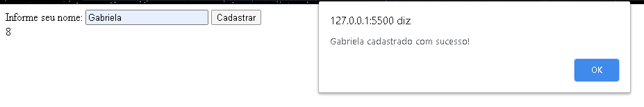

# Contador de Letras 🔢

---

<p align="center">
   
</p>

<div align="center">

[](https://github.com/gabiqrm/ContadorLetra)<space> <space>[](https://github.com/gabiqrm/ContadorLetra/blob/master/LICENSE)<space> <space>[](https://github.com/gabiqrm/ContadorLetra/)

</div>

---
## 🔎 Acesso Rápido:
https://gabiqrm.github.io/ContadorLetra/

---

## 📋 Sobre:

Esse é um estudo de eventos, no qual uma linha de texto que representa o tipo de evento a ser esperado. Listener: O objeto que recebe uma notificação quando um evento do tipo especificado ocorre. Esse objeto precisa implementar a interface do EventListener, ou simplesmente executar uma função JavaScript. Com isso criei um contador de letras.

---
## ⚙️ Tecnologias:

```bash
📍 HTML5
📍 JavaScript
```

---
##  Execução:
```
1. Clonar via prompt de comando o projeto em uma pasta de sua preferência: `git clone https://github.com/ContadorLetra`
2. Acessar a pasta principal do projeto via prompt de comando. Ex: `cd ContadorLetra`;
3. Na pasta raiz, executar o arquivo: `index.html`
```

---
## 🔗 Contribuições:
```
- Faça o fork do projeto (https://github.com/ContadorLetra)
- Crie uma branch para sua modificação (git checkout -b feature/[nome])
- Faça o commit (git commit -am 'Add files [nome]')
- Push (git push origin feature/[nome])
- Crie um novo Pull Request
```
---
## 🔐 Licença:
Esse projeto está sob a licença MIT. Veja o arquivo [LICENSE](LICENSE) para mais detalhes.

---

## 👩🏻‍💻 Desenvolvedora:

Desenvolvido por Gabriela Queiroz ! 💜
